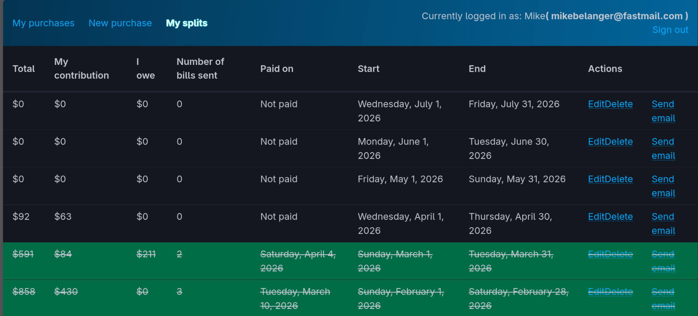

# Vanilla Expense Tracker

## What

Vanilla Splits is a web-based expense tracker which is designed for two people to split monthly expenses. Each user can log into the application, and enter the expenses they want to split for a given month.  At the end of the month, the application will email each user the total expenses for that month, and who owes who how much.

## Why

There's two main motivations for this application:

-  Split expenses between myself and a roommate. I've used Google Sheets to track expenses before this. While Google Sheets is easier to get started, I've found it more awkward to automate, and more error-prone.
- An excuse to test out some cool technologies. Namely, the [Lucky web framework](https://luckyframework.org), [Caddy](https://caddyserver.com/), [Podman (Podman kube, in particular)](https://podman.io), [Pico.css](https://picocss.com/), [Bun](https://bun.dev), [Custom elements](https://developer.mozilla.org/en-US/docs/Web/API/Web_components/Using_custom_elements) and good 'ol vanilla javascript. 
- Eventually, incorporate [View Transitions.](https://developer.mozilla.org/en-US/docs/Web/API/View_Transition_API) on the frontend, and something called [Quadlets](https://www.redhat.com/en/blog/quadlet-podman) on the backend.

## Guiding Tech Principles

- Use statically-typed, nil-safe langauges ([Crystal](https://crystal-lang.org/) in backend, [Typescript](https://www.typescriptlang.org/) in frontend).
- Have a "fat", opinionated backend ([Lucky](https://luckyframework.org)) and ["slim", un-opinionated frontend](https://plainvanillaweb.com/) (typescript and some web components).
- Everything is containerized in [Podman](https://podman.io).

## Limitations

- Cannot support splitting expenses between more than **two** people.
- Will not fully run on [Safari](https://www.apple.com/safari/) or any WebKit-based browser as they [do not support extended elements.](https://github.com/WebKit/standards-positions/issues/97)
- Current mail adapter is a version of [Mailersend](https://mailersend.com) [that I forked](https://github.com/mikebelanger/carbon_mailersend_adapter). I don't actively maintain this fork, at least fully.

## Development

### Prerequisites

- [Podman](https://podman.io) (Linux, macOS, or WSL on Windows)

### Quick start

```sh
./containers/dev/build.sh
```

This auto-generates secrets, builds the API and scheduler images, pre-labels SELinux volumes (if applicable), and starts the pod. Visit [http://localhost:8888](http://localhost:8888).

The frontend uses bun in watch mode — any changes to `src/ts/` recompile automatically. The Lucky API server also hot-reloads on file changes.

### Logs

```sh
podman pod logs -f --color --names vanilla-dev
```

Or use [LazyJournal](https://github.com/Lifailon/lazyjournal) — a TUI log viewer
that auto-detects Podman containers and supports fuzzy search, regex filtering,
and syntax highlighting:

```sh
lazyjournal
```

### Stop / Start

```sh
podman pod stop vanilla-dev
podman pod start vanilla-dev
```

### Clean rebuild

Remove the pod, then re-run `build.sh`:

```sh
podman pod rm vanilla-dev
./containers/dev/build.sh
```

## Production

### CI

Pushing to `main` triggers a [GitHub Actions](.github/workflows/ci.yml) workflow that runs checks and specs, then builds and pushes images to `ghcr.io/mikebelanger/lucky-vanilla/`.

### VPS deployment

The production stack runs on a VPS with **rootless Podman** and **Quadlets**. Reference files are in `containers/systemd/`:

- `vanilla-app.kube` — Pod spec pointing at `containers/prod/pod.yml` and the ConfigMaps
- `vanilla-app.timer` — (optional, superseded by `podman-auto-update.timer`)

The `containers/prod/pod.yml` containers carry the `io.containers.autoupdate=registry`
label so that **Podman's built-in auto-update** mechanism handles pulling fresh images
from GHCR and restarting the pod automatically.

#### One-time VPS setup

```sh
# Copy the containers directory to the VPS (replace host/port as needed)
scp -r containers deploy@vanillasplit.com:/home/deploy/vanilla-app/

# SSH into the VPS
ssh deploy@vanillasplit.com

# Generate the production ConfigMaps (config.yml is committed, secrets.yml
# is gitignored and auto-generated by this script). Cross-reference the
# database auth credentials (DATABASE_URL, POSTGRES_DB, POSTGRES_USER,
# POSTGRES_PASSWORD) against config/database.cr to make sure they match:
./containers/prod/build.sh

# Log into GHCR with a personal access token (read:packages scope)
podman login ghcr.io

# Create named volumes (Podman creates these on first use, but doing it
# explicitly avoids permission issues with postgres data and Caddy certs)
podman volume create vanilla_prod_pg_data
podman volume create vanilla_prod_caddy_data

# Install the Quadlet file (copies to ~/.config/containers/systemd/)
podman quadlet install --replace containers/systemd/vanilla-app.kube

# The .kube file uses ../add-subdir/ as a deliberate placeholder.
# Edit it to absolute paths matching your server layout, e.g.:
#   Yaml=/path/to/containers/prod/pod.yml
#   ConfigMap=/path/to/containers/prod/config.yml
#   ConfigMap=/path/to/containers/prod/secrets.yml
nano ~/.config/containers/systemd/vanilla-app.kube

# Start the pod
systemctl --user daemon-reload
systemctl --user start vanilla-app.service

# Enable Podman's built-in auto-update timer (runs daily, checks for newer
# images and restarts the pod if any were pulled):
systemctl --user enable --now podman-auto-update.timer

# To customize the schedule (e.g. 2am EST), create an override:
# mkdir -p ~/.config/systemd/user/podman-auto-update.timer.d
# cat > ~/.config/systemd/user/podman-auto-update.timer.d/override.conf << 'EOF'
# [Timer]
# OnCalendar=*-*-* 02:00:00 America/New_York
# EOF
# systemctl --user daemon-reload

# Open firewall ports
sudo firewall-cmd --permanent --add-port=80/tcp --add-port=443/tcp
sudo firewall-cmd --reload
```

If `systemctl --user start vanilla-app.service` fails because rootless Podman
can't bind to ports 80/443, you need to lower the unprivileged port floor:

```sh
# Check current value
sysctl net.ipv4.ip_unprivileged_port_start    # default is 1024

# Set it to 80 (or lower) so rootless Podman can publish low ports
echo 'net.ipv4.ip_unprivileged_port_start = 80' | sudo tee /etc/sysctl.d/99-rootless-podman.conf
sudo sysctl --system
```
